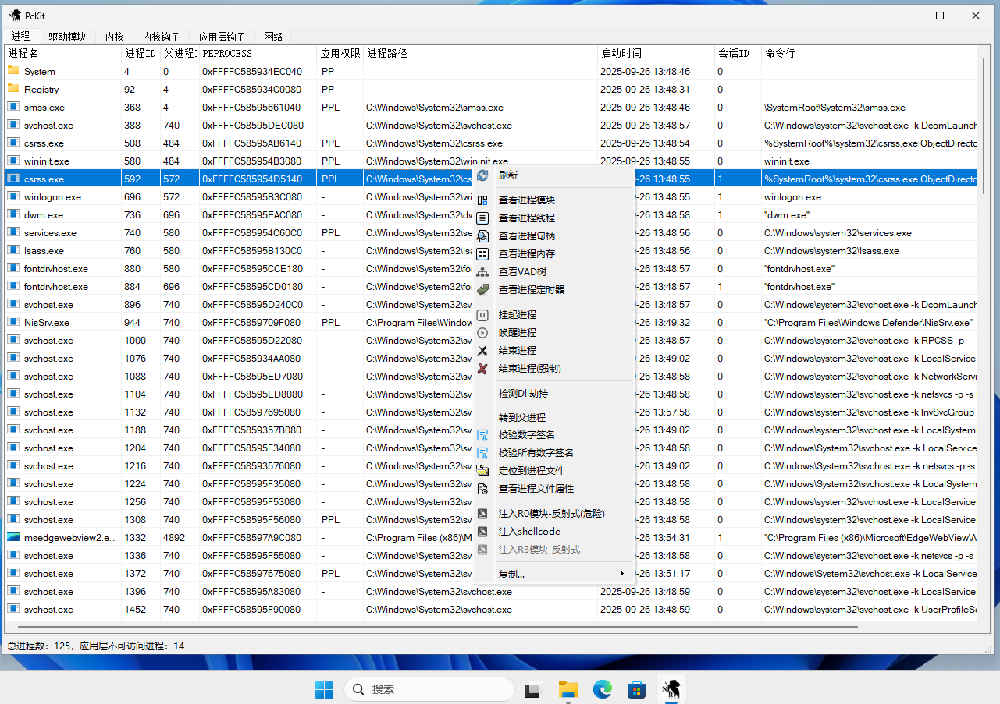

# PcKitArk

- 免责声明：
  - 本软件一个免费的软件, 如果您使用本软件, 给您直接或者间接造成损失、损害, 本人概不负责. 从您使用本软件的一刻起, 将视为您已经接受了本免责声明.
  - 本软件加了VMProtect壳, 可能有些杀毒软件会报毒...请大家放心使用, 这属于杀毒软件误报.**不支持启用内核隔离**.
  - 本软件免费, 但未获得作者书面授权, 禁止用于商业用途; 另外禁止本软件用于恶意用途(比如作为病毒木马的一部分、破解网吧收费系统等等).
  - **驱动未进行驱动签名**, 请自行对驱动文件签名或开启调试模式, (已签名但还加载驱动失败)请禁用Secure Boot或微软Ev签名或虚拟机使用.
  - 本软件仅限于学习交流，如侵权请在24小时进行删除.

- 使用说明：
  1. 双击 pdb_symbols_download.bat 下载符号文件（采用官方公共符号服务器）
  2. 双击 PcKitArk.exe 执行程序即可

- 支持系统：
  - win10x64、win11x64(至23h2)

- 功能：
  - 进程：
    - 支持查看进程、模块、线程、句柄、VAD树、进程定时器、内存 等信息。
    - 支持 挂起/唤醒/结束 进程-线程、线程栈回溯、进程内存修改、模块卸载、句柄权限修改/关闭 等常用操作。
    - 支持dll劫持检测、数字签名校验。
    - 支持驱动模块注入、x64 shellcode注入。
  - 驱动模块：支持驱动模块信息查看、数字签名校验、启动方式修改、IRP分发历程查看等操作。
  - 内核：
    - 系统回调：支持查看 进程创建、线程创建、镜像加载、注册表、bug检测、关机、注销、即插即用等回调函数信息，支持反汇编
    - 支持 过滤驱动、DPC定时器、Hal、wdf、文件系统、GDT 等信息查看。
  - 内核钩子：
    - 支持 fsd、键盘、i8042、鼠标、partmgr、disk、ssdt、ShadowSsdt、Object钩子 信息查看等操作。
  - 应用层钩子：支持 消息钩子、内核回调表、进程钩子 信息查看
  - 网络：支持 Tcp/NsiProxy/Tdx 派遣函数查看，支持wpf信息查看
  - 更多功能正在开发中...

- 其他：
  - pdb_symbols_download.bat仅会下载程序运行所需必要\[速度更快\]的符号文件。如果希望栈回溯相关功能可以提供更全面的信息，请双击pdb_symbols_download_all.bat

- 致谢：
  - PCHunter团队、YDArk团队（参考该软件UI设计与功能）.
  - 欢迎大家使用，若是发现BUG, 请及时联系反馈提交Issue。

- 操作界面

